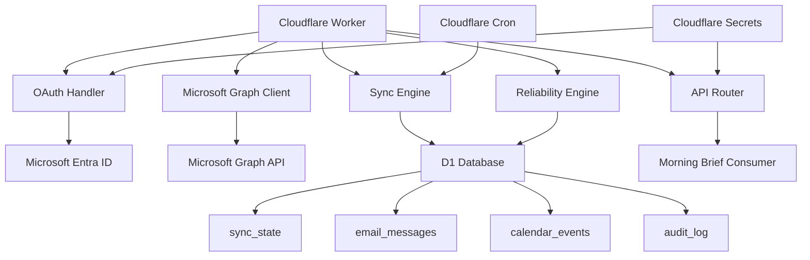
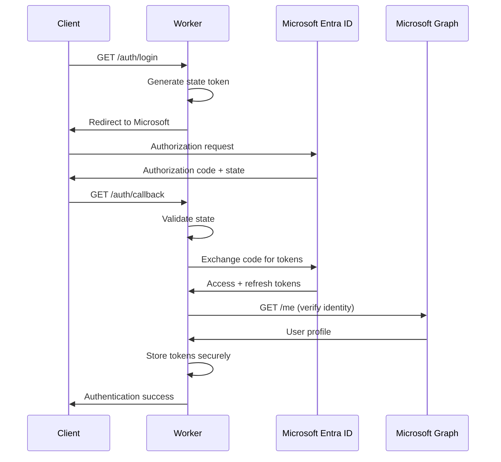
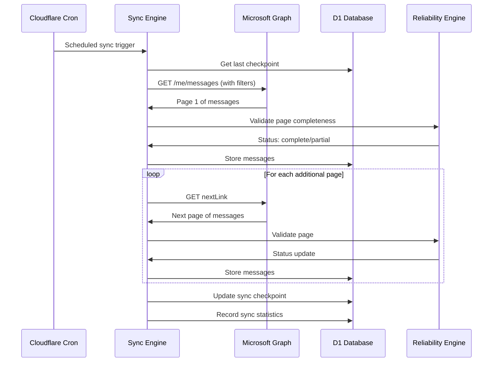
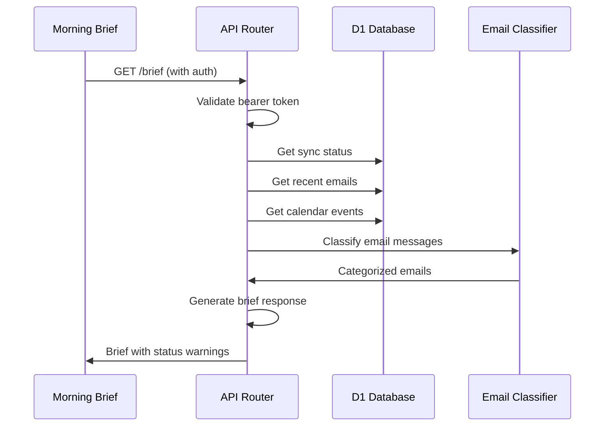

# Design Document: Microsoft 365 Mail Connector

## Overview

The Microsoft 365 Mail Connector is a production-quality, single-user system that provides a reliable bridge between Microsoft 365 services and Reinier's Morning Intelligence Brief. The system runs on Cloudflare Workers and uses Microsoft Graph API with delegated OAuth to synchronize email and calendar data, create email drafts, and manage calendar events. The connector emphasizes reliability and completeness detection as core features, implementing checkpoint-based synchronization with failure retention to ensure data integrity and service continuity.

The system follows an 18-phase development approach with clean modular architecture, comprehensive error handling, and security best practices. It maintains audit trails, implements rate limiting and retry logic, and provides detailed status reporting to support operational reliability and troubleshooting.

## Architecture



## Sequence Diagrams

### OAuth Authentication Flow


### Email Synchronization Flow



### Morning Brief Generation Flow



## Components and Interfaces

### OAuth Handler Component

**Purpose**: Manages Microsoft OAuth 2.0 authorization code flow and token lifecycle

**Interface**:
```typescript
interface OAuthHandler {
  initiateLogin(): Promise<LoginRedirect>
  handleCallback(code: string, state: string): Promise<AuthResult>
  refreshTokens(): Promise<TokenRefreshResult>
  logout(): Promise<void>
  validateTokens(): Promise<boolean>
}

interface LoginRedirect {
  redirectUrl: string
  state: string
}

interface AuthResult {
  success: boolean
  tokens?: TokenSet
  user?: MicrosoftUser
  error?: string
}

interface TokenRefreshResult {
  success: boolean
  tokens?: TokenSet
  error?: string
}

interface TokenSet {
  accessToken: string
  refreshToken: string
  expiresAt: Date
  scope: string
}
```

**Responsibilities**:
- Generate secure OAuth state parameters
- Handle authorization code exchange
- Manage token refresh lifecycle
- Validate token expiration and scope
### Microsoft Graph Client Component

**Purpose**: Provides typed, reliable interface to Microsoft Graph API with automatic token management

**Interface**:
```typescript
interface GraphClient {
  getMessages(options: MessageQueryOptions): Promise<RetrievalResult<EmailMessage>>
  getCalendarEvents(options: CalendarQueryOptions): Promise<RetrievalResult<CalendarEvent>>
  createDraft(draft: DraftMessage): Promise<CreateResult>
  createCalendarEvent(event: CalendarEventInput): Promise<CreateResult>
  updateCalendarEvent(id: string, updates: CalendarEventUpdate): Promise<UpdateResult>
  getUserProfile(): Promise<MicrosoftUser>
}

interface MessageQueryOptions {
  from?: Date
  to?: Date
  top?: number
  skip?: number
  select?: string[]
  filter?: string
  orderBy?: string
}

interface CalendarQueryOptions {
  startTime: Date
  endTime: Date
  top?: number
  skip?: number
}

interface RetrievalResult<T> {
  status: RetrievalStatus
  items: T[]
  itemsChecked: number
  pagesChecked: number
  paginationComplete: boolean
  startedAt: Date
  completedAt: Date
  nextLink?: string
  error?: GraphError
}

type RetrievalStatus = 
  | "complete"
  | "partial" 
  | "failed"
  | "unauthorized"
  | "rate_limited"
  | "source_unavailable"
```

**Responsibilities**:
- Automatic Authorization header management
- Token refresh on 401 responses
- Request timeout and retry handling
- Rate limit backoff implementation
- Graph error translation and logging
- Request ID generation for diagnostics

### Sync Engine Component

**Purpose**: Orchestrates reliable data synchronization with checkpoint management

**Interface**:
```typescript
interface SyncEngine {
  syncEmails(): Promise<SyncResult>
  syncCalendar(): Promise<SyncResult>
  syncAll(): Promise<CompleteSyncResult>
  getLastSuccessfulSync(source: SyncSource): Promise<SyncCheckpoint | null>
  validateCompleteness(result: RetrievalResult<any>): SyncValidation
}

interface SyncResult {
  source: SyncSource
  status: RetrievalStatus
  itemsProcessed: number
  pagesProcessed: number
  startedAt: Date
  completedAt: Date
  checkpoint?: SyncCheckpoint
  retainedPrevious: boolean
  error?: SyncError
}

interface SyncCheckpoint {
  source: SyncSource
  timestamp: Date
  cursor?: string
  itemCount: number
  lastMessageId?: string
  lastEventId?: string
}

type SyncSource = "email" | "calendar"

interface CompleteSyncResult {
  overall: RetrievalStatus
  email: SyncResult
  calendar: SyncResult
  warnings: string[]
}
```

**Responsibilities**:
- Checkpoint-based incremental synchronization
- Failure retention (preserve previous data on sync failure)
- Completeness validation and warning generation
- Deduplication using Graph resource IDs
- Sync statistics collection and reporting
### API Router Component

**Purpose**: Handles HTTP routing, authentication, and endpoint management

**Interface**:
```typescript
interface APIRouter {
  handleRequest(request: Request, env: Environment): Promise<Response>
  validateBearerToken(request: Request): Promise<AuthValidation>
  handleAuthEndpoints(request: Request): Promise<Response>
  handleEmailEndpoints(request: Request): Promise<Response>
  handleCalendarEndpoints(request: Request): Promise<Response>
  handleBriefEndpoint(request: Request): Promise<Response>
  handleHealthEndpoints(request: Request): Promise<Response>
}

interface AuthValidation {
  valid: boolean
  error?: string
}

interface BriefResponse {
  generated_at: string
  source_status: {
    overall: RetrievalStatus
    email: RetrievalStatus
    calendar: RetrievalStatus
  }
  email: {
    new_messages: EmailMessage[]
    important_messages: EmailMessage[]
    marketing_messages: EmailMessage[]
    unread_messages: EmailMessage[]
  }
  calendar: {
    today: CalendarEvent[]
    next_7_days: CalendarEvent[]
  }
  warnings: string[]
}
```

**Responsibilities**:
- Route classification and handler dispatch
- Bearer token authentication for private endpoints
- Request validation and sanitization
- Response formatting and error handling
- CORS and security header management

### Reliability Engine Component

**Purpose**: Ensures data retrieval completeness and handles failure scenarios

**Interface**:
```typescript
interface ReliabilityEngine {
  validateRetrievalResult<T>(result: RetrievalResult<T>): SyncValidation
  shouldRetainPreviousData(newResult: SyncResult, previousCheckpoint: SyncCheckpoint | null): boolean
  generateWarnings(syncResults: CompleteSyncResult): string[]
  classifyFailure(error: GraphError): FailureClassification
  calculateBackoffDelay(attempt: number, failureType: FailureClassification): number
}

interface SyncValidation {
  isComplete: boolean
  isReliable: boolean
  warningMessage?: string
  recommendedAction: "proceed" | "retry" | "alert" | "failover"
}

interface FailureClassification {
  type: "transient" | "authentication" | "rate_limit" | "service_unavailable" | "permanent"
  retryable: boolean
  backoffMultiplier: number
}
```

**Responsibilities**:
- Pagination completeness verification
- Failure classification and retry strategy
- Data retention decision making
- Warning generation for incomplete results
- Exponential backoff calculation

## Data Models

### Sync State Model

```typescript
interface SyncStateRecord {
  id: string
  source: SyncSource
  last_attempt_at: Date
  last_success_at: Date | null
  last_success_cursor: string | null
  status: RetrievalStatus
  error_code: string | null
  error_message: string | null
  messages_checked: number
  events_checked: number
  pages_checked: number
  pagination_complete: boolean
  updated_at: Date
}
```

**Validation Rules**:
- `source` must be "email" or "calendar"
- `last_attempt_at` is always set for active records
- `last_success_at` is null until first successful sync
- `pagination_complete` must be true for status "complete"
- `error_code` and `error_message` are null when status is "complete"
### Email Message Model

```typescript
interface EmailMessage {
  id: string
  graph_message_id: string
  conversation_id: string | null
  internet_message_id: string | null
  received_at: Date
  sender_email: string
  sender_name: string | null
  subject: string
  is_read: boolean
  importance: "low" | "normal" | "high"
  has_attachments: boolean
  classification: "new" | "important" | "marketing" | "unclassified"
  body_preview: string | null
  web_link: string | null
  first_seen_at: Date
  last_seen_at: Date
}
```

**Validation Rules**:
- `graph_message_id` must be unique across all records
- `received_at` must be valid ISO 8601 datetime
- `sender_email` must be valid email format
- `subject` cannot be null (use empty string for missing)
- `classification` defaults to "unclassified"
- `first_seen_at` and `last_seen_at` track sync visibility

### Calendar Event Model

```typescript
interface CalendarEvent {
  id: string
  graph_event_id: string
  subject: string
  start_at: Date
  end_at: Date
  timezone: string
  location: string | null
  organiser: string | null
  response_status: "none" | "accepted" | "declined" | "tentative"
  is_cancelled: boolean
  body_preview: string | null
  first_seen_at: Date
  last_seen_at: Date
}
```

**Validation Rules**:
- `graph_event_id` must be unique across all records  
- `start_at` must be before or equal to `end_at`
- `timezone` must be valid IANA timezone identifier
- `response_status` defaults to "none" for organizer's events
- `is_cancelled` defaults to false

### Audit Log Model

```typescript
interface AuditLogRecord {
  id: string
  timestamp: Date
  operation: "create" | "update" | "delete" | "sync" | "auth"
  resource_type: "email" | "calendar" | "draft" | "token" | "sync_state"
  resource_id: string | null
  result: "success" | "failure" | "partial"
  requested_by: string | null
  details_json: string | null
}
```

**Validation Rules**:
- `timestamp` automatically set to current UTC time
- `operation` must be from predefined enum values
- `resource_id` is null for bulk operations
- `details_json` contains structured operation metadata
- `requested_by` identifies API caller (null for system operations)

## Algorithmic Pseudocode

### Main Synchronization Algorithm

```typescript
async function synchronizeAllSources(): Promise<CompleteSyncResult> {
  const startTime = new Date()
  const results: CompleteSyncResult = {
    overall: "failed",
    email: null as any,
    calendar: null as any,
    warnings: []
  }
  
  try {
    // Precondition: Valid authentication tokens exist
    await validateAndRefreshTokens()
    
    // Step 1: Synchronize email with checkpoint recovery
    results.email = await syncEmailWithCheckpoint()
    
    // Step 2: Synchronize calendar with checkpoint recovery  
    results.calendar = await syncCalendarWithCheckpoint()
    
    // Step 3: Determine overall status
    results.overall = determineOverallStatus(results.email, results.calendar)
    
    // Step 4: Generate warnings for incomplete results
    results.warnings = generateSyncWarnings(results)
    
    // Postcondition: Sync results properly classified
    assert(isValidSyncResult(results))
    
    return results
    
  } catch (error) {
    // Failure recovery: retain previous state
    await auditLog("sync", "sync_state", null, "failure", error.message)
    throw new SyncError("Complete sync failed", error)
  }
}
```

**Preconditions**:
- Microsoft Graph authentication tokens are available
- D1 database connection is established
- Sync state table exists and is accessible

**Postconditions**:
- Sync results contain valid status classifications
- Previous data is retained on failure scenarios
- Audit log entries record all operations
- Checkpoint data is updated only on successful syncs

**Loop Invariants**: N/A (sequential operations)

### Email Synchronization with Checkpoint Recovery

```typescript
async function syncEmailWithCheckpoint(): Promise<SyncResult> {
  // Get last successful checkpoint
  const checkpoint = await getLastSuccessfulCheckpoint("email")
  const safetyOverlap = checkpoint ? new Date(checkpoint.timestamp.getTime() - 3600000) : null
  
  let result: SyncResult = {
    source: "email",
    status: "failed",
    itemsProcessed: 0,
    pagesProcessed: 0,
    startedAt: new Date(),
    completedAt: new Date(),
    retainedPrevious: false
  }
  
  try {
    // Step 1: Build query with safety overlap window
    const query = buildEmailQuery(safetyOverlap)
    
    // Step 2: Retrieve with complete pagination
    const retrievalResult = await retrieveEmailsWithPagination(query)
    
    // Step 3: Validate completeness
    const validation = validateEmailCompleteness(retrievalResult)
    
    if (validation.isReliable) {
      // Step 4a: Process and deduplicate messages
      const processed = await processAndDeduplicateEmails(retrievalResult.items)
      
      // Step 5a: Update checkpoint on success
      const newCheckpoint = createEmailCheckpoint(retrievalResult)
      await saveEmailCheckpoint(newCheckpoint)
      
      result = {
        ...result,
        status: validation.isComplete ? "complete" : "partial",
        itemsProcessed: processed.length,
        pagesProcessed: retrievalResult.pagesChecked,
        checkpoint: newCheckpoint,
        retainedPrevious: false
      }
      
    } else {
      // Step 4b: Failure - retain previous data
      result.retainedPrevious = true
      result.status = "failed"
      
      // Do NOT update checkpoint
      // Do NOT clear existing email data
      await auditLog("sync", "email", null, "failure", validation.warningMessage)
    }
    
    result.completedAt = new Date()
    return result
    
  } catch (error) {
    result.retainedPrevious = true
    result.status = "failed"
    result.completedAt = new Date()
    result.error = error
    
    await auditLog("sync", "email", null, "failure", error.message)
    return result
  }
}
```

**Preconditions**:
- Graph client is authenticated and available
- Email messages table exists
- Sync state table exists

**Postconditions**:
- On success: checkpoint updated and new messages stored
- On failure: previous checkpoint and data retained unchanged
- Sync result accurately reflects operation outcome
- All operations are logged to audit trail

**Loop Invariants**:
- For pagination loop: all previously processed pages are recorded
- For deduplication loop: processed items maintain referential integrity
### Complete Pagination Algorithm

```typescript
async function retrieveEmailsWithPagination(query: MessageQueryOptions): Promise<RetrievalResult<EmailMessage>> {
  const result: RetrievalResult<EmailMessage> = {
    status: "failed",
    items: [],
    itemsChecked: 0,
    pagesChecked: 0,
    paginationComplete: false,
    startedAt: new Date(),
    completedAt: new Date()
  }
  
  let currentUrl: string | null = buildInitialGraphUrl(query)
  let pageCount = 0
  
  try {
    // Continue until no more pages exist
    while (currentUrl !== null) {
      pageCount++
      
      // Fetch current page with retry logic
      const pageResponse = await fetchWithRetry(currentUrl)
      
      if (!pageResponse.success) {
        // Page failure - mark as partial
        result.status = "partial" 
        result.paginationComplete = false
        result.error = pageResponse.error
        break
      }
      
      // Process page data
      const pageData = pageResponse.data
      result.items.push(...pageData.value)
      result.itemsChecked += pageData.value.length
      
      // Check for next page
      currentUrl = pageData["@odata.nextLink"] || null
      
      // Loop invariant: all previous pages successfully processed
      assert(result.itemsChecked >= pageCount * query.top || pageData.value.length < query.top)
    }
    
    result.pagesChecked = pageCount
    
    // Determine final status
    if (currentUrl === null) {
      result.paginationComplete = true
      result.status = "complete"
    }
    
    result.completedAt = new Date()
    return result
    
  } catch (error) {
    result.status = "failed"
    result.paginationComplete = false
    result.error = error
    result.completedAt = new Date()
    return result
  }
}
```

**Preconditions**:
- `query` contains valid Microsoft Graph query parameters
- Graph client has valid authentication token
- Network connectivity to Microsoft Graph is available

**Postconditions**:
- `paginationComplete` is true if and only if all pages were successfully retrieved
- `status` is "complete" only when pagination is complete and no errors occurred
- `items` contains all successfully retrieved messages
- `itemsChecked` equals the sum of all page item counts

**Loop Invariants**:
- `pageCount` accurately tracks number of pages processed
- `result.itemsChecked` equals sum of items from all processed pages
- `currentUrl` is null if and only if no more pages exist

### Token Refresh Algorithm

```typescript
async function validateAndRefreshTokens(): Promise<TokenValidationResult> {
  try {
    const currentTokens = await getStoredTokens()
    
    if (!currentTokens) {
      return { valid: false, error: "No tokens available", requiresAuth: true }
    }
    
    // Check token expiration with 5-minute buffer
    const expirationBuffer = new Date(Date.now() + 5 * 60 * 1000)
    
    if (currentTokens.expiresAt > expirationBuffer) {
      // Token still valid
      return { valid: true, tokens: currentTokens }
    }
    
    // Token expired - attempt refresh
    const refreshResult = await refreshAccessToken(currentTokens.refreshToken)
    
    if (refreshResult.success) {
      // Store new tokens securely
      await storeTokensSecurely(refreshResult.tokens)
      
      return { valid: true, tokens: refreshResult.tokens }
    } else {
      // Refresh failed - require re-authentication
      await clearStoredTokens()
      
      return { 
        valid: false, 
        error: "Token refresh failed", 
        requiresAuth: true 
      }
    }
    
  } catch (error) {
    return { 
      valid: false, 
      error: error.message, 
      requiresAuth: true 
    }
  }
}
```

**Preconditions**:
- Token storage mechanism is available and accessible
- Microsoft Token endpoint is accessible for refresh operations
- Refresh token (if available) has not been revoked

**Postconditions**:
- If result.valid is true, tokens are guaranteed valid for at least 5 minutes
- If result.requiresAuth is true, full OAuth flow must be re-initiated
- Token storage is updated with fresh tokens on successful refresh
- Invalid tokens are cleared from storage to prevent reuse

**Loop Invariants**: N/A (sequential operations with no loops)

## Key Functions with Formal Specifications

### Function: processAndDeduplicateEmails()

```typescript
async function processAndDeduplicateEmails(
  messages: GraphMessage[]
): Promise<EmailMessage[]>
```

**Preconditions:**
- `messages` is a valid array of GraphMessage objects
- Each GraphMessage has a unique `id` property from Microsoft Graph
- Database connection is established and email_messages table exists

**Postconditions:**
- Returns array of processed EmailMessage objects with internal IDs
- No duplicate `graph_message_id` values exist in returned array
- All returned messages are stored in email_messages table
- `first_seen_at` is set for new messages, `last_seen_at` updated for existing

**Loop Invariants:**
- For processing loop: all previously processed messages maintain unique graph_message_id
- For deduplication loop: existing database records are preserved

### Function: buildEmailQuery()

```typescript
function buildEmailQuery(
  safetyOverlap: Date | null
): MessageQueryOptions
```

**Preconditions:**
- `safetyOverlap` is either null (for initial sync) or valid Date (for incremental sync)
- If provided, `safetyOverlap` must be in the past

**Postconditions:**
- Returns valid MessageQueryOptions with appropriate filters
- If safetyOverlap provided, query includes receivedDateTime filter
- Query includes necessary $select parameters for required fields
- Query limits page size to manageable number (e.g., 50 items)

**Loop Invariants:** N/A (pure function, no loops)

### Function: createCalendarEvent()

```typescript
async function createCalendarEvent(
  eventInput: CalendarEventInput
): Promise<CreateResult>
```

**Preconditions:**
- `eventInput` contains valid event data with required fields
- `eventInput.start_at` is before or equal to `eventInput.end_at`
- User has authenticated and has Calendars.ReadWrite permission
- `eventInput.timezone` is valid IANA timezone identifier

**Postconditions:**
- If successful: event created in Microsoft 365 calendar
- If successful: event record stored in calendar_events table
- If successful: audit log entry created with "create" operation
- If failed: no changes made to calendar or database
- Returns result with success status and created event ID or error details

**Loop Invariants:** N/A (single operation, no loops)
## Example Usage

### OAuth Authentication Flow

```typescript
// Example 1: Initiate login
const authHandler = new OAuthHandler(env)
const loginRedirect = await authHandler.initiateLogin()

// Redirect user to loginRedirect.redirectUrl
// User authenticates and returns with code and state

// Example 2: Handle callback
const authResult = await authHandler.handleCallback(
  code, 
  state
)

if (authResult.success) {
  console.log(`Authenticated user: ${authResult.user.displayName}`)
} else {
  console.error(`Auth failed: ${authResult.error}`)
}

// Example 3: Automatic token refresh
const graphClient = new GraphClient(env)
const messages = await graphClient.getMessages({
  from: new Date('2024-01-01'),
  top: 50
})
```

### Email Synchronization

```typescript
// Example 1: Manual email sync
const syncEngine = new SyncEngine(env)
const emailResult = await syncEngine.syncEmails()

console.log(`Email sync: ${emailResult.status}`)
console.log(`Processed: ${emailResult.itemsProcessed} messages`)

if (emailResult.status === "partial") {
  console.warn("Email sync incomplete - previous data retained")
}

// Example 2: Complete sync with status checking
const completeResult = await syncEngine.syncAll()

if (completeResult.overall !== "complete") {
  console.warn("Sync incomplete:")
  completeResult.warnings.forEach(warning => console.warn(warning))
}
```

### Morning Brief Generation

```typescript
// Example 1: Generate morning brief
const apiRouter = new APIRouter(env)
const request = new Request('https://worker.domain.com/brief', {
  headers: { 'Authorization': 'Bearer api-token-here' }
})

const response = await apiRouter.handleBriefEndpoint(request)
const brief: BriefResponse = await response.json()

console.log(`Brief generated at: ${brief.generated_at}`)
console.log(`New messages: ${brief.email.new_messages.length}`)
console.log(`Today's events: ${brief.calendar.today.length}`)

if (brief.warnings.length > 0) {
  brief.warnings.forEach(warning => console.warn(warning))
}

// Example 2: Draft email creation
const draftResult = await graphClient.createDraft({
  subject: "Follow-up from Morning Brief",
  body: "Generated from connector system",
  toRecipients: ["colleague@company.com"]
})

if (draftResult.success) {
  console.log(`Draft created: ${draftResult.id}`)
}
```

### Reliability Engine Usage

```typescript
// Example 1: Validate retrieval completeness
const reliabilityEngine = new ReliabilityEngine()
const retrievalResult = await graphClient.getMessages({top: 50})

const validation = reliabilityEngine.validateRetrievalResult(retrievalResult)

if (!validation.isComplete) {
  console.warn(`Incomplete retrieval: ${validation.warningMessage}`)
  
  if (validation.recommendedAction === "retry") {
    // Implement retry logic with backoff
    const delay = reliabilityEngine.calculateBackoffDelay(1, "transient")
    setTimeout(() => retrySync(), delay)
  }
}

// Example 2: Failure classification
try {
  await graphClient.getMessages()
} catch (error) {
  const classification = reliabilityEngine.classifyFailure(error)
  
  if (classification.retryable) {
    const backoff = reliabilityEngine.calculateBackoffDelay(
      attemptCount, 
      classification.type
    )
    scheduleRetry(backoff)
  } else {
    alertOperations("Permanent failure detected", error)
  }
}
```

## Correctness Properties

*A property is a characteristic or behavior that should hold true across all valid executions of a system-essentially, a formal statement about what the system should do. Properties serve as the bridge between human-readable specifications and machine-verifiable correctness guarantees.*

### Property 1: OAuth Security and Permission Constraint

*For any* OAuth authentication flow, the system SHALL generate cryptographically secure state parameters, validate state consistency, and never request Mail.Send permissions under any circumstances.

**Validates: Requirements 1.1, 1.2, 1.5, 9.4, 18.4**

### Property 2: Token Lifecycle Integrity

*For any* authentication token with expiration time, automatic refresh SHALL occur when expiring within 5 minutes, token validation SHALL enforce required permission scope, and invalid tokens SHALL trigger secure cleanup and re-authentication.

**Validates: Requirements 2.1, 2.2, 2.3, 2.4, 2.5**

### Property 3: Graph API Reliability

*For any* Microsoft Graph API request, the client SHALL include proper authorization headers, implement exponential backoff for rate limiting and transient errors, handle timeouts gracefully, and generate unique request IDs without logging sensitive data.

**Validates: Requirements 3.1, 3.2, 3.3, 3.4, 3.5**

### Property 4: Complete Pagination Handling

*For any* paginated Microsoft Graph response (email or calendar), the sync engine SHALL follow all @odata.nextLink references until completion, mark sync as partial when any page fails, and set paginationComplete to false for incomplete pagination sequences.

**Validates: Requirements 4.1, 4.2, 5.1**

### Property 5: Data Deduplication and Collection

*For any* data synchronization operation, the system SHALL deduplicate items using Graph resource IDs as unique identifiers, collect all required metadata fields, and maintain referential integrity during processing.

**Validates: Requirements 4.3, 4.4, 5.2, 5.3**

### Property 6: Checkpoint-Based Reliability

*For any* synchronization attempt, successful operations SHALL save checkpoint data with safety overlap windows, failed operations SHALL preserve previous checkpoint state unchanged, and incremental syncs SHALL use safety overlap to prevent data gaps.

**Validates: Requirements 4.5, 6.1, 6.2, 6.3, 6.4**

### Property 7: Sync Status Classification

*For any* synchronization result, the system SHALL classify status as complete, partial, failed, unauthorized, rate_limited, or source_unavailable, track comprehensive statistics, distinguish between "no new data" and "sync incomplete", and generate appropriate warnings for operational visibility.

**Validates: Requirements 6.5, 7.1, 7.2, 7.3, 7.4, 7.5**

### Property 8: API Authentication and Authorization

*For any* private API endpoint request, the system SHALL validate Bearer token authentication, return 401 for unauthenticated requests, and include data reliability warnings in responses when sources are incomplete.

**Validates: Requirements 8.1, 8.2, 8.5, 10.3**

### Property 9: Morning Brief Data Structure

*For any* morning brief generation, the system SHALL return properly categorized email data (new, important, marketing, unread messages) and filtered calendar data (today's events, next 7 days events) with consistent JSON structure.

**Validates: Requirements 8.3, 8.4**

### Property 10: Draft Creation Without Sending

*For any* email draft creation request, the system SHALL validate required fields (subject, body, recipients), create drafts via Microsoft Graph without sending capability, and return appropriate error details for troubleshooting when creation fails.

**Validates: Requirements 9.1, 9.2, 9.3, 9.5**

### Property 11: Calendar Event Management

*For any* calendar event operation, the system SHALL validate temporal constraints (start ≤ end), require authentication, verify existing events before updates to prevent conflicts, and ensure timezone handling is correct.

**Validates: Requirements 10.1, 10.2, 10.5, 5.5**

### Property 12: Comprehensive Audit Logging

*For any* data modification operation, the system SHALL create audit log entries with timestamp, operation type, resource type, result, and requester information, while never logging sensitive content (tokens, email bodies, private calendar data).

**Validates: Requirements 10.4, 11.1, 11.2, 11.3, 11.4, 11.5**

### Property 13: Scheduled Operation Reliability

*For any* scheduled synchronization trigger, the system SHALL perform complete email and calendar sync, validate and refresh authentication tokens, update sync status appropriately, and maintain system stability during error scenarios.

**Validates: Requirements 12.1, 12.2, 12.3, 12.4, 12.5**

### Property 14: Status and Health Reporting Security

*For any* status or health endpoint request, the system SHALL return operational information without exposing sensitive data (OAuth tokens, user credentials, mailbox content), provide appropriate detail levels based on endpoint type, and maintain security boundaries.

**Validates: Requirements 13.1, 13.2, 13.3, 13.4, 13.5**

### Property 15: Error Classification and Recovery

*For any* system error or failure, the reliability engine SHALL classify errors correctly (transient, authentication, rate_limit, service_unavailable, permanent), implement appropriate retry strategies with exponential backoff and maximum limits, and preserve system state during service unavailability.

**Validates: Requirements 14.1, 14.2, 14.3, 14.4, 14.5**

### Property 16: Security and Input Validation

*For any* external data input (OAuth parameters, Graph responses, user inputs), the system SHALL validate and sanitize content, use secure storage mechanisms for sensitive data, implement proper SQL parameterization, and sanitize error messages to prevent information disclosure.

**Validates: Requirements 15.1, 15.2, 15.3, 15.4, 15.5**

### Property 17: Single-User Constraint Enforcement

*For any* authentication or authorization attempt, the system SHALL accept only Reinier's specific Microsoft 365 account, implement single-user database schema and application logic, and handle personal data with appropriate privacy protections within the Cloudflare Workers environment.

**Validates: Requirements 18.1, 18.2, 18.3, 18.5**

## Error Handling

### Error Scenario 1: Microsoft Graph API Rate Limiting

**Condition**: Microsoft Graph returns 429 Too Many Requests with Retry-After header
**Response**: Implement exponential backoff with jitter, respecting Retry-After values
**Recovery**: Queue operation for retry after calculated delay, maintain sync state

### Error Scenario 2: Token Expiration During Operation

**Condition**: Graph API returns 401 Unauthorized due to expired access token
**Response**: Attempt automatic token refresh using stored refresh token
**Recovery**: Retry original operation with new token, fallback to full OAuth flow if refresh fails

### Error Scenario 3: Incomplete Pagination

**Condition**: Graph API page request fails mid-pagination sequence
**Response**: Mark sync as "partial", retain all successfully retrieved data
**Recovery**: Next sync attempt starts from last successful checkpoint with safety overlap

### Error Scenario 4: Database Connection Failure

**Condition**: D1 database becomes unavailable during sync operation
**Response**: Fail gracefully without data corruption, maintain previous state
**Recovery**: Queue sync for retry when database connectivity restored

### Error Scenario 5: OAuth State Mismatch

**Condition**: OAuth callback receives state parameter that doesn't match stored value
**Response**: Reject authentication attempt, clear session state, log security event
**Recovery**: Redirect user to initiate fresh authentication flow

## Testing Strategy

### Unit Testing Approach

Focus on individual component testing with comprehensive mocking of external dependencies. Key test categories:

- **OAuth Handler**: State generation, token validation, refresh logic, security scenarios
- **Graph Client**: Request building, error handling, pagination logic, token management  
- **Sync Engine**: Checkpoint management, failure scenarios, deduplication logic
- **Reliability Engine**: Completeness validation, failure classification, backoff calculations
- **API Router**: Authentication, routing, response formatting, error boundaries

**Coverage Goals**: 95% line coverage, 100% critical path coverage

**Property Test Library**: fast-check for TypeScript property-based testing

### Property-Based Testing Approach

Generate random test cases to verify system properties hold across wide input ranges:

- **Email Deduplication**: Generate sets of messages with duplicates, verify deduplication correctness
- **Pagination Logic**: Generate various page sizes and counts, verify completeness detection
- **Token Refresh**: Generate various token expiration scenarios, verify refresh behavior
- **Checkpoint Recovery**: Generate failure scenarios, verify data retention properties
- **API Authentication**: Generate valid/invalid bearer tokens, verify access control

### Integration Testing Approach

Test component interactions with controlled external service mocking:

- **End-to-End OAuth Flow**: Mock Microsoft Entra ID responses, verify complete flow
- **Graph API Integration**: Mock Graph responses including errors, verify handling
- **Database Operations**: Test against actual D1 database, verify data integrity
- **Cron Scheduling**: Test scheduled sync execution, verify reliability properties
- **Morning Brief Generation**: Test complete data flow from sync to brief output

## Performance Considerations

**Pagination Batch Size**: Limit Graph API requests to 50 items per page to balance throughput with memory usage and timeout constraints.

**Concurrent Operations**: Process email and calendar synchronization in parallel where possible, but sequence checkpoint updates to maintain consistency.

**Database Query Optimization**: Use indexed queries on `graph_message_id` and `graph_event_id` for deduplication. Batch database insertions within transactions.

**Memory Management**: Stream process large result sets rather than loading entire datasets into memory. Use pagination cursors to minimize memory footprint.

**Caching Strategy**: Cache Microsoft Graph schema metadata and user profile information for the duration of request processing.

**Rate Limit Compliance**: Implement adaptive request timing based on Graph API rate limit headers and historical response patterns.

## Security Considerations

**Token Storage**: Store OAuth tokens using Cloudflare Worker Secrets with automatic rotation. Never log access tokens, refresh tokens, or sensitive user data.

**API Authentication**: Require Bearer token authentication for all private endpoints. Use cryptographically secure random tokens with sufficient entropy.

**Input Validation**: Sanitize all external inputs including Graph API responses and user-provided data. Validate data types, ranges, and formats.

**Audit Logging**: Log all data modification operations with timestamps, sources, and results. Exclude sensitive content from logs while maintaining operational visibility.

**HTTPS Enforcement**: Enforce HTTPS for all communications. Validate SSL certificates and implement proper certificate pinning where applicable.

**OAuth Security**: Implement secure state parameter generation, validate redirect URIs, and use PKCE (Proof Key for Code Exchange) where supported.

**Error Information Disclosure**: Sanitize error messages returned to clients to prevent information leakage while maintaining debugging capability.

## Dependencies

**Runtime Dependencies**:
- Cloudflare Workers Runtime (JavaScript V8 engine)
- Cloudflare D1 SQL Database
- Cloudflare Worker Secrets for credential storage
- Cloudflare Cron Triggers for scheduled operations

**External Services**:
- Microsoft Graph API (https://graph.microsoft.com)
- Microsoft Entra ID OAuth endpoints
- Microsoft 365 Exchange Online
- Microsoft 365 Calendar services

**Development Dependencies**:
- TypeScript 5.x for type safety and development experience
- Wrangler CLI for local development and deployment
- Vitest or Jest for unit and integration testing
- fast-check for property-based testing
- ESLint and Prettier for code quality and formatting